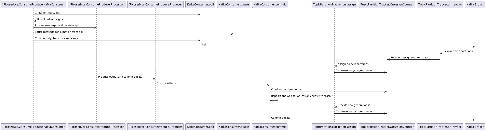

# plantuml
plantuml test

  

```plantuml
@startuml
participant "IPicoserivce.ConsumeProduce.KafkaConsumer" as consumer
participant "IPicoserivce.ConsumeProduce.Processor" as processor
participant "IPicoserivce.ConsumeProduce.Producer" as producer
participant "KafkaConsumer.poll" as poll
participant "KafkaConsumer.pause" as pause_consumer
participant "KafkaConsumer.commit" as commit
participant "TopicPartitionTracker.on_assign" as assign
participant "TopicPartitionTracker.OnAssignCounter" as counter
participant "TopicPartitionTracker.on_revoke" as revoke
participant "Kafka Broker" as kafka


consumer -> poll: Check for messages
poll -> consumer: Download messages
consumer -> processor: Process messages and create output
consumer -> pause_consumer: Pause message consumption from poll
consumer -> poll: Continuously check for a rebalance
poll -> kafka: Poll
kafka -> revoke: Revoke some partitions
revoke -> counter: Reset on_assign counter to zero
kafka -> assign: Assign no new partitions
assign -> counter: Increment on_assign counter
processor -> producer: Produce output and commit offsets
producer -> commit: Commit offsets
commit -> counter: Check on_assign counter
commit -> commit: Repeart and wait for on_assign counter to reach 2
kafka -> assign: Provide new generation id
assign -> counter: Increment on_assign counter
commit -> kafka: Commit offsets
@enduml
```

