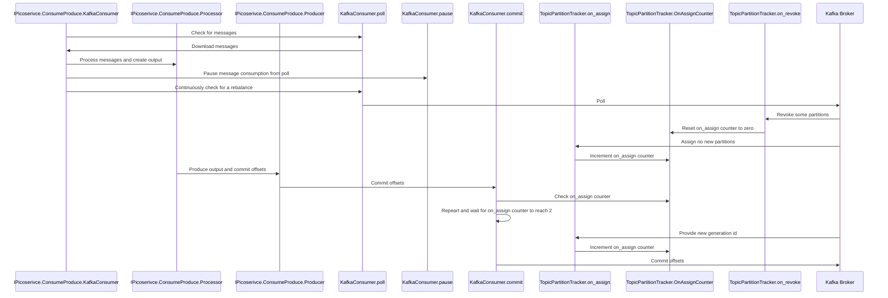

# plantuml
plantuml test

```mermaid
sequenceDiagram
    participant consumer as IPicoserivce.ConsumeProduce.KafkaConsumer
    participant processor as IPicoserivce.ConsumeProduce.Processor
    participant producer as IPicoserivce.ConsumeProduce.Producer
    participant poll as KafkaConsumer.poll
    participant pause_consumer as KafkaConsumer.pause
    participant commit as KafkaConsumer.commit
    participant assign as TopicPartitionTracker.on_assign
    participant counter as TopicPartitionTracker.OnAssignCounter
    participant revoke as TopicPartitionTracker.on_revoke
    participant kafka as Kafka Broker

    consumer->>poll: Check for messages
    poll->>consumer: Download messages
    consumer ->> processor: Process messages and create output
    consumer ->> pause_consumer: Pause message consumption from poll
    consumer ->> poll: Continuously check for a rebalance
    poll ->> kafka: Poll
    kafka ->> revoke: Revoke some partitions
    revoke ->> counter: Reset on_assign counter to zero
    kafka ->> assign: Assign no new partitions
    assign ->> counter: Increment on_assign counter
    processor ->> producer: Produce output and commit offsets
    producer ->> commit: Commit offsets
    commit ->> counter: Check on_assign counter
    commit ->> commit: Repeart and wait for on_assign counter to reach 2
    kafka ->> assign: Provide new generation id
    assign ->> counter: Increment on_assign counter
    commit ->> kafka: Commit offsets
```
